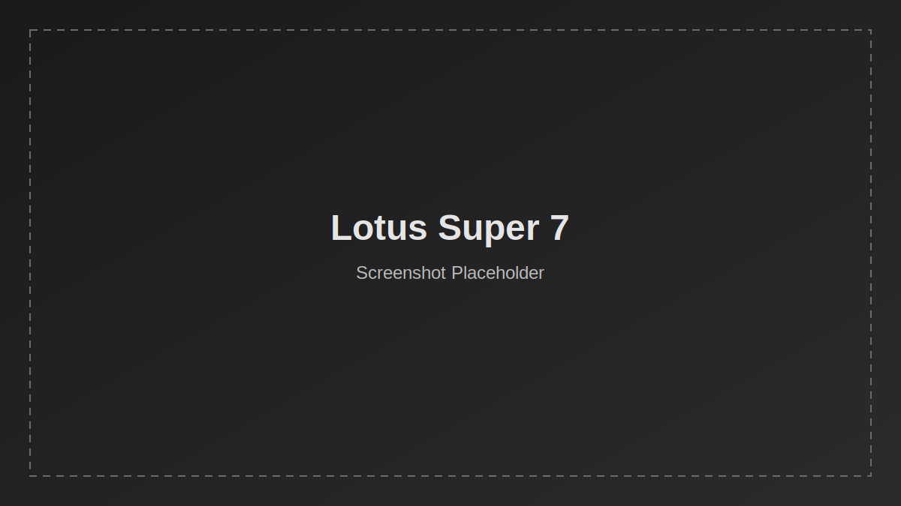

# Lotus Super 7 Showcase

A small Astro site showcasing a 1962 Lotus Super 7 (Series II), with sections for hero content, background, specs, and modifications.

## Tech Stack

- Astro 5
- Static component-based page structure

## Getting Started

### Prerequisites

- Node.js 18+ (recommended)
- npm

### Install

```bash
npm install
```

### Run locally

```bash
npm run dev
```

Open the local URL shown in the terminal (typically http://localhost:4321).

## Available Scripts

- `npm run dev` — Start the development server
- `npm run build` — Create a production build in `dist/`
- `npm run preview` — Preview the production build locally
- `npm.cmd run clean:tmp` — Remove temporary `tmpclaude-*` folders from project root (use `npm.cmd` in PowerShell if script execution is restricted)

## Project Structure

```text
src/
  components/
    About.astro
    Hero.astro
    Mods.astro
    Specs.astro
  layouts/
    Layout.astro
  pages/
    index.astro
public/
astro.config.mjs
```

## Deployment

### Cloudflare Pages (free static hosting)

Use these settings in your Cloudflare Pages project:

- Framework preset: `Astro`
- Build command: `npm run build`
- Build output directory: `dist`
- Deploy command (if required):

```bash
npx wrangler pages deploy dist --project-name lotus-super-7
```

Important: do **not** use `npx wrangler deploy` for this project. That command deploys a Worker flow and can fail for this static Astro setup.

Optional environment variable for build stability:

- `NODE_VERSION=20`

## Repository

GitHub: https://github.com/Ninjinkai/lotus-super-7

## Screenshot



_Replace `public/screenshot-placeholder.svg` with an actual screenshot of the site._
